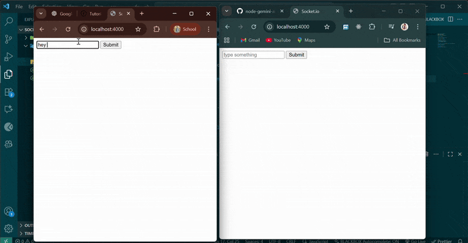

# Learn Socket.io 

This repository is a **beginner-friendly project** built to understand how **Socket.io** works with **Node.js**.
It demonstrates how to create a **real-time chat-like system** using just a few lines of code.

---

## 📸 Preview

---

##  Conclusion

This small project taught me the core concept of **real-time data flow** on the web.
It’s a solid foundation for creating chat apps, live notifications, multiplayer games, or any **real-time features** in future projects.

